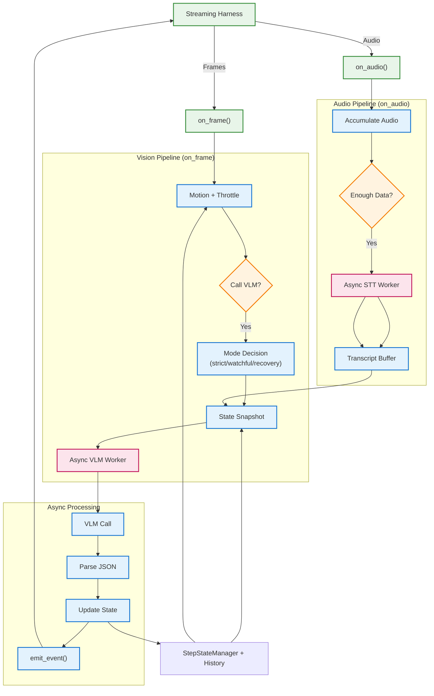

```mermaid
flowchart TD
    %% =========================
    %% ENTRY POINTS
    %% =========================
    Harness[Streaming Harness]

    Harness -->|Frames| OnFrame["on_frame()"]
    Harness -->|Audio| OnAudio["on_audio()"]

    %% =========================
    %% VISION PATH
    %% =========================
    subgraph "Vision Pipeline (on_frame)"
        Detect[Motion + Throttle]
        Decide{Call VLM?}
        Mode["Mode Decision<br/>(strict/watchful/recovery)"]
        Snapshot[State Snapshot]
        AsyncVLM[Async VLM Worker]

        Detect --> Decide
        Decide -->|Yes| Mode
        Mode --> Snapshot
        Snapshot --> AsyncVLM
    end

    OnFrame --> Detect

    %% =========================
    %% AUDIO PATH
    %% =========================
    subgraph "Audio Pipeline (on_audio)"
        Buffer[Accumulate Audio]
        Chunk{Enough Data?}
        AsyncSTT[Async STT Worker]
        Transcript[Transcript Buffer]

        Buffer --> Chunk
        Chunk -->|Yes| AsyncSTT
        AsyncSTT --> Transcript
    end

    OnAudio --> Buffer

    %% =========================
    %% ASYNC PROCESSING
    %% =========================
    subgraph "Async Processing"
        VLM[VLM Call]
        Parse[Parse JSON]
        Update[Update State]
        Emit["emit_event()"]

        VLM --> Parse --> Update --> Emit
    end

    AsyncVLM --> VLM
    Transcript --> Snapshot
    AsyncSTT --> Transcript

    %% =========================
    %% SHARED STATE
    %% =========================
    State[StepStateManager + History]

    Update --> State
    State --> Snapshot
    State --> Detect

    %% Feedback loop
    Emit --> Harness

    %% =========================
    %% STYLING
    %% =========================
    classDef entry fill:#e8f5e9,stroke:#388e3c,stroke-width:2px
    classDef decision fill:#fff3e0,stroke:#f57c00,stroke-width:2px
    classDef async fill:#fce4ec,stroke:#c2185b,stroke-width:2px
    classDef core fill:#e3f2fd,stroke:#1976d2,stroke-width:2px

    class Harness,OnFrame,OnAudio entry
    class Decide,Chunk decision
    class AsyncVLM,AsyncSTT async
    class Detect,Mode,Snapshot,VLM,Parse,Update,Emit,Buffer,Transcript core
```